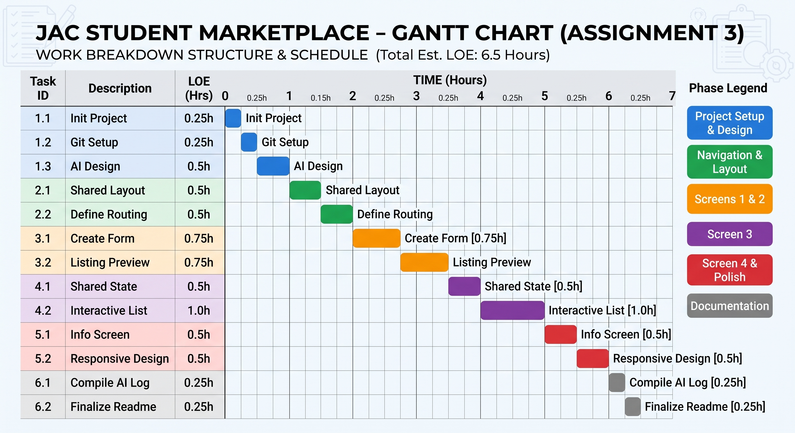

# Assignment 3: WBS, LOE Estimates, and Gantt Chart

**Course:** Application Development 2
**App Topic:** JAC Student Marketplace (JACPot)

## 1. Project Overview

This project is a multi-platform (Android + Desktop/Web) application that serves as a student marketplace for John Abbott College. It utilizes Kotlin/Compose Multiplatform, Navigation 3, and Material 3 to provide 4 primary screens: a listing creation form, an item preview screen, an interactive feed of listings, and an informational "About" screen.

## 2. Work Breakdown Structure (WBS) & Level of Effort (LOE) Estimates

The project has been broken down into 6 primary task categories with at least 5 distinct subtasks as required. The total estimated Level of Effort (LOE) is 6.5 hours.

| Task ID | Task Description                                                          | Dependencies  | Estimated LOE |
| :------ | :------------------------------------------------------------------------ | :------------ | :------------ |
| **1.0** | **Project Setup & Preliminary Design**                                    | **None**      | **1.0 hr**    |
| 1.1     | Initialize Kotlin/Compose Multiplatform project (Android + Desktop/Web)   | None          | 0.25 hrs      |
| 1.2     | Setup Git repository and main machine environment                         | 1.1           | 0.25 hrs      |
| 1.3     | Iterate with AI on preliminary design and document findings               | 1.2           | 0.5 hrs       |
| **2.0** | **Navigation & Core Layout**                                              | **1.0**       | **1.0 hr**    |
| 2.1     | Implement shared layout with persistent navigation bar                    | 1.1           | 0.5 hrs       |
| 2.2     | Define routing using a sealed class and set up Navigation 3               | 2.1           | 0.5 hrs       |
| **3.0** | **Data Entry & Preview Screens (Screens 1 & 2)**                          | **2.0**       | **1.5 hrs**   |
| 3.1     | Build "Create Listing" form with Material 3 inputs and image URL field    | 2.2           | 0.75 hrs      |
| 3.2     | Implement visually compelling "Listing Preview" screen passing parameters | 3.1           | 0.75 hrs      |
| **4.0** | **Interactive State & Feed Screen (Screen 3)**                            | **3.0**       | **1.5 hrs**   |
| 4.1     | Implement shared state provider for the list of items                     | 3.1           | 0.5 hrs       |
| 4.2     | Build interactive list (view details, remove items)                       | 4.1           | 1.0 hr        |
| **5.0** | **Information Screen & Polish**                                           | **2.0**       | **1.0 hr**    |
| 5.1     | Design visually impressive "About JAC Marketplace" screen                 | 2.2           | 0.5 hrs       |
| 5.2     | Apply responsive design for smaller/larger screens (Bonus Requirement)    | 2.1           | 0.5 hrs       |
| **6.0** | **Documentation & Final Review**                                          | **1.0 - 5.0** | **0.5 hrs**   |
| 6.1     | Compile AI usage log in ADR format (min. 3 key decisions)                 | 1.3           | 0.25 hrs      |
| 6.2     | Finalize Readme and compile actual LOE metrics                            | 6.1           | 0.25 hrs      |
|         | **Total Estimated LOE**                                                   |               | **6.5 hrs**   |

## 3. Gantt Chart

(Note: The Gantt chart below visually maps the task dependencies and expected durations in a waterfall sequence.)

